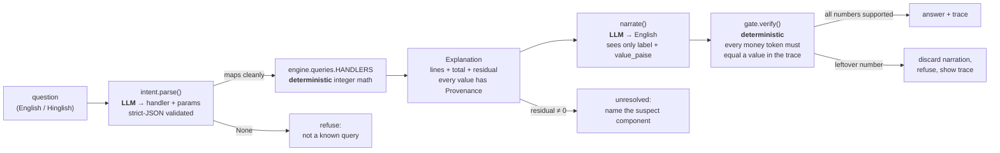

# Hisaab

## 1. The problem

A merchant sees a Razorpay payout land — say **₹1,384.60** for settlement
`setl_1` — and has no idea how it was built. The dashboard shows a total, not a
derivation. Hisaab answers the plain-English question *"why did I only receive
₹1,384.60?"* with the arithmetic spelled out and every figure cited to a source
row:

| line | amount | source |
|------|-------:|--------|
| gross | ₹1,500.00 | `payments:pay_1.gross_paise`, `payments:pay_2.gross_paise` |
| fees | −₹30.00 | `fees:pay_1.fee_paise`, `fees:pay_2.fee_paise` |
| tax (GST on fee) | −₹5.40 | `fees:pay_1.tax_paise`, `fees:pay_2.tax_paise` |
| refunds | −₹50.00 | `refunds:rfnd_1.amount_paise` |
| adjustments | −₹30.00 | `adjustments:adj_1.amount_paise` (reserve hold) |
| **net** | **₹1,384.60** | `settlements:setl_1.net_paise` |

If the parts don't add up to the stated net, Hisaab says so and names the
component most likely to carry the gap — it never papers over a discrepancy.

## 2. This is not reconciliation

Reconciliation matches two independent records — your books against the bank
statement — and flags every line where they disagree. Hisaab explains *one*
number by rebuilding it from its constituent rows with a citation for each; it
decomposes, it does not compare two ledgers.

## 3. Architecture



The LLM sits only at the two ends — turning words into a query, and turning a
finished calculation into a sentence. Everything numeric between those points is
plain integer arithmetic over the frozen domain contract in
`hisaab/domain/models.py`.

## 4. Where the LLM is and is not

| Stage | LLM? | Why |
|-------|:----:|-----|
| question → intent (`hisaab/llm/intent.py`) | **yes** | natural-language understanding. Output is JSON validated against a pydantic `Intent` (handler + required params); one retry, then it returns `None` and the pipeline refuses. |
| intent → `Explanation` — **all arithmetic** (`hisaab/engine/`) | **no** | money is integer paise, computed deterministically. The LLM never sees a ledger row and never adds, subtracts, or rounds. Every line is emitted with `Provenance` (source table, row id, field). |
| `Explanation` → English (`hisaab/llm/narrate.py`) | **yes** | phrasing only. The model is handed `{label, value_paise}` pairs plus `residual`/`resolved` — never raw payments, refunds, dates, or ids. |
| English → shown answer — **the gate** (`hisaab/llm/gate.py`) | **no** | a regex pulls every money-shaped token out of the narration; each must reconcile (rupee or paise reading, sign-insensitive) to a `value_paise` already in the trace. Any leftover is an *unsupported number*: the narration is thrown away and replaced with a refusal. |

**Why arithmetic is never LLM-side.** Settlement math is a money-correctness
problem: a number that is off by one paisa is not "roughly right", it is wrong,
and a number a model produced in its head cannot be audited. Keeping the
computation deterministic means every figure is reproducible from the same
inputs and traceable to the row it came from. The model's errors are then
confined to word choice — and the gate catches any figure it invents anyway.

## 5. Run in 3 commands

```bash
pip install -r requirements.txt

# 1. generate the seed-42 question set from the ledger's ground truth
python -m eval.gen_questions --seed 42

# 2. score all 300 questions offline (deterministic stub, no network, no key)
python -m eval.run --seed 42 --questions eval/questions.yaml --offline

# 3. run the tests (40, includes the adversarial scoreboard)
pytest
```

`python -m eval.run` builds the 250-settlement seed-42 ledger in-process; the
checked-in `eval/questions.yaml` is the seed-42 set, regenerated by step 1.
To ask one ad-hoc question against the built-in demo ledger:

    python -m hisaab.cli "explain settlement setl_1"

### Running the LLM path

The two LLM ends — intent parse and narrate — are off by default. To turn them
on, copy `.env.example` (which documents every variable) to `.env` and set one
provider:

    HISAAB_LLM_PROVIDER=groq
    GROQ_API_KEY=<your key>
    GROQ_MODEL=openai/gpt-oss-120b

Then drop `--offline`. `.env` is gitignored. With no key — or with `--offline` —
`intent.parse` and `narrate` fall back to the deterministic regex stub, so
every command above runs with no network. Each run prints a stderr banner
naming the active path (`LLM: groq/openai/gpt-oss-120b` or `OFFLINE: regex
stub`).

The LLM path is verified on a 20-question smoke test —
`python -m eval.run --seed 42 --questions eval/questions.yaml --limit 20` —
20/20 correct, 0 fallbacks. The section 6 headline numbers are the deterministic
offline baseline: a full 300-question run is 600 provider calls and was
impractical on free-tier throughput.

## 6. Results

Real output of
`python -m eval.run --seed 42 --questions eval/questions.yaml --offline`
(offline deterministic stub, `eval/report.md`). 250 settlements · 300 questions.

| metric | value | denominator |
|--------|------:|-------------|
| Intent classification | 252 | / 300 questions |
| Answer numerically correct | 217 | / 240 answerable |
| Wrong answer — all intent misroutes, 0 value bugs | 23 | / 240 answerable |
| **WRONG refusal** (refused a question that had an answer) | 0 | / 240 answerable |
| UNSUPPORTED NUMBERS (gate caught, must be 0) | 0 | / 300 |
| Correct refusals | 60 | / 60 unanswerable |
| Answered the unanswerable | 0 | / 60 unanswerable |
| Config-error / rate-limit fallbacks | 0 | / 300 |
| Mean latency | 1 | ms/question (stub) |

Exit code **0**.

The 23 wrong answers are all the offline regex stub routing a question to the
wrong handler before any arithmetic runs — every one is
`expected_intent != got_handler`, zero cases where the right handler ran and
returned a wrong number. The gate has never let an invented figure through.

The 60 unresolved exceptions are period-comparison questions ("why were my
tuesday settlements lower") and out-of-scope attribute questions ("what card
network did settlement X use") that the system correctly refuses rather than
guessing — there is no handler to route them to. That is intended behaviour,
not failure; all 60 score as correct refusals.

## 7. Honest limitations

- **Synthetic data only.** `hisaab/generate/ledger.py` builds a Razorpay-shaped
  ledger where every settlement's net holds by construction. There is **no live
  Razorpay Settlements API** integration and no CSV loader — `cli.py` reads
  `data/ledger.json` if present, else a hardcoded demo ledger.
- **Headline numbers are the offline deterministic stub.** The LLM path runs
  (section 5, "Running the LLM path") but a full 300-question / 600-call scored
  run was impractical on free-tier throughput, so the deterministic baseline is
  what section 6 reports. The LLM path is verified only on a 20-question smoke.
- **23 wrong answers, all intent misroutes.** The offline stub in
  `hisaab/llm/intent.py` mis-routes ~23 questions to the wrong handler — "GST"
  not recognised as the `tax` component, Hinglish "katauti"/"aur" missing from
  the keyword lists, "gross minus fees minus tax" matching `component_breakdown`
  instead of `explain_settlement`. Zero are arithmetic bugs; every one is
  `expected_intent != got_handler`. A real LLM in the intent slot is expected to
  close most of this gap. See `FAILURES.md`.
- **60 refused questions with no handler.** Period-over-period analysis ("why
  were my tuesday settlements lower", "compare this tuesday to last tuesday")
  and attribute lookups the domain model doesn't carry ("what card network",
  "which city"). `hisaab/engine/queries.py` has no trend/anomaly handler; the
  system refuses, which is correct. Only a new query type fixes these, not a
  better parser.
- **`KeyError` on unknown settlement ids** (`stl_9000`…) — `decompose()` raises
  instead of returning an unresolved `Explanation`. The eval still scores these
  as correct refusals, but the engine should degrade gracefully (F6).

## 8. What I'd build next

1. **Score the full LLM path.** The swappable adapter and a 20-question smoke run
   exist (section 5); a full 300-question / 600-call scored run needs a paid key
   or a higher free tier. Report intent/narration quality, per-question latency,
   and token cost against the stub baseline.
2. **Real ledger loader.** Razorpay Settlements API + CSV import behind the
   existing `Ledger` contract, with the synthetic generator kept for eval.
3. **Date-phrase parsing + a period-comparison handler.** Map "last tuesday",
   "January", "this week" to date ranges and add a trend/anomaly query type, so
   the 60 currently-unanswerable temporal questions get a real answer instead of
   a refusal.
4. **Tighten the offline intent stub** (or lean on the LLM): the 23 misroutes
   are all missing keywords / greedy matches in `hisaab/llm/intent.py`.
5. **Graceful unknown-id handling** in the engine (F6): unresolved `Explanation`
   with a reason, not a `KeyError`.
