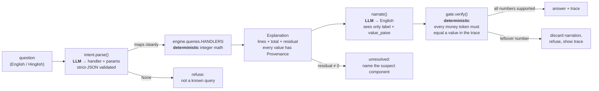

# Hisaab

## 1. The problem

A merchant sees a Razorpay payout land — say **₹1,384.60** for settlement
`setl_1` — and has no idea how it was built. The dashboard shows a total, not a
derivation. Hisaab answers the plain-English question *"why did I only receive
₹1,384.60?"* with the arithmetic spelled out and every figure cited to a source
row:

| line | amount | source |
|------|-------:|--------|
| gross | ₹1,500.00 | `payments:pay_1.gross_paise`, `payments:pay_2.gross_paise` |
| fees | −₹30.00 | `fees:pay_1.fee_paise`, `fees:pay_2.fee_paise` |
| tax (GST on fee) | −₹5.40 | `fees:pay_1.tax_paise`, `fees:pay_2.tax_paise` |
| refunds | −₹50.00 | `refunds:rfnd_1.amount_paise` |
| adjustments | −₹30.00 | `adjustments:adj_1.amount_paise` (reserve hold) |
| **net** | **₹1,384.60** | `settlements:setl_1.net_paise` |

If the parts don't add up to the stated net, Hisaab says so and names the
component most likely to carry the gap — it never papers over a discrepancy.

## 2. This is not reconciliation

Reconciliation matches two independent records — your books against the bank
statement — and flags every line where they disagree. Hisaab explains *one*
number by rebuilding it from its constituent rows with a citation for each; it
decomposes, it does not compare two ledgers.

## 3. Architecture



The LLM sits only at the two ends — turning words into a query, and turning a
finished calculation into a sentence. Everything numeric between those points is
plain integer arithmetic over the frozen domain contract in
`hisaab/domain/models.py`.

## 4. Where the LLM is and is not

| Stage | LLM? | Why |
|-------|:----:|-----|
| question → intent (`hisaab/llm/intent.py`) | **yes** | natural-language understanding. Output is JSON validated against a pydantic `Intent` (handler + required params); one retry, then it returns `None` and the pipeline refuses. |
| intent → `Explanation` — **all arithmetic** (`hisaab/engine/`) | **no** | money is integer paise, computed deterministically. The LLM never sees a ledger row and never adds, subtracts, or rounds. Every line is emitted with `Provenance` (source table, row id, field). |
| `Explanation` → English (`hisaab/llm/narrate.py`) | **yes** | phrasing only. The model is handed `{label, value_paise}` pairs plus `residual`/`resolved` — never raw payments, refunds, dates, or ids. |
| English → shown answer — **the gate** (`hisaab/llm/gate.py`) | **no** | a regex pulls every money-shaped token out of the narration; each must reconcile (rupee or paise reading, sign-insensitive) to a `value_paise` already in the trace. Any leftover is an *unsupported number*: the narration is thrown away and replaced with a refusal. |

**Why arithmetic is never LLM-side.** Settlement math is a money-correctness
problem: a number that is off by one paisa is not "roughly right", it is wrong,
and a number a model produced in its head cannot be audited. Keeping the
computation deterministic means every figure is reproducible from the same
inputs and traceable to the row it came from. The model's errors are then
confined to word choice — and the gate catches any figure it invents anyway.

## 5. Run in 3 commands

```bash
pip install -r requirements.txt

# optional: pick an LLM provider. Copy the template and add ONE key.
cp .env.example .env        # then edit: HISAAB_LLM_PROVIDER + that provider's key

# ask one question against a built-in demo ledger
python -m hisaab.cli "explain settlement setl_1"

# build a 250-settlement ledger for seed 42 and score all 300 questions
python -m eval.run --seed 42 --questions eval/questions.yaml
```

`.env.example` documents every variable (`HISAAB_LLM_PROVIDER` = `gemini` |
`anthropic` | `groq` | `offline`, the per-provider key, `HISAAB_LLM_DELAY_MS`).
`.env` is gitignored. With no key set — or with `--offline` on either command —
`intent.parse` and `narrate` fall back to a deterministic regex stub, so
everything above runs with no network. Every run prints a stderr banner naming
the active path (`LLM: gemini/gemini-2.5-flash` or `OFFLINE: regex stub`).

`eval/questions.yaml` is regenerated from the ledger's ground truth with
`python -m eval.gen_questions --seed 42`; the checked-in copy is for seed 42.

## 6. Results

Real output of `python -m eval.run --seed 42`, offline stub pipeline
(`eval/report.md`). 250 settlements · 300 questions.

| metric | value | denominator |
|--------|------:|-------------|
| Intent classification | 250 | / 300 questions |
| Answer numerically correct | 36 | / 240 answerable |
| Wrong answer | 132 | / 240 answerable |
| **WRONG refusal** (refused a question that had an answer) | 72 | / 240 answerable |
| UNSUPPORTED NUMBERS (gate caught, must be 0) | 57 | / 300 |
| Correct refusals | 60 | / 60 unanswerable |
| Answered the unanswerable | 0 | / 60 unanswerable |
| Mean latency | 2 | ms/question (stub) |
| LLM-path scores + latency + cost | **TODO** | needs an API key; not yet measured |

Exit code is **1** — `UNSUPPORTED NUMBERS > 0`.

By bucket:

| bucket | n | intent ok | answer ok | wrong answer | wrong refusal | correct refusal |
|--------|--:|----------:|----------:|-------------:|--------------:|----------------:|
| straightforward | 180 | 173 | 15 | 93 | 72 | – |
| edge | 60 | 44 | 21 | 39 | 0 | – |
| ambiguous (must refuse) | 40 | 15 | – | – | – | 40 |
| unanswerable (must refuse) | 20 | 18 | – | – | – | 20 |

The refusal machinery is solid (60/60). The answer numbers are low for one
dominant reason, in section 7 and `FAILURES.md`.

## 7. Honest limitations

- **Synthetic data only.** `hisaab/generate/ledger.py` builds a Razorpay-shaped
  ledger where every settlement's net holds by construction. There is **no live
  Razorpay Settlements API** integration and no CSV loader — `cli.py` reads
  `data/ledger.json` if present, else a hardcoded demo ledger.
- **All reported numbers are the offline deterministic stubs.** No
  `ANTHROPIC_API_KEY` was available; `have_llm()` is `False`, so the real
  `/v1/messages` intent-parse and narration paths are untested and unscored.
- **132 unresolved exceptions** in the run, listed in full in `eval/report.md`.
  They break down as:
  - **72 wrong refusals + ~90 wrong answers** — the engine assigns payments to a
    settlement by a *date window*, because the frozen domain model has no
    `settlement_id` on `Payment`/`Fee`/`Refund`. The generator assigns them by
    construction with capture times at a random hour 1–2 days before the payout,
    so the two partitions disagree and most decompositions carry a large
    residual (`computed_net` ≈ 1.5–3× `stated_net`). Example:
    `Q0094 "what is the net amount of settlement stl_0010" -> fees suspect: …
    residual=-9971155 paise`. This is failure **F4** and it dominates the score.
  - **6 `KeyError`** on questions naming a nonexistent settlement
    (`stl_9000`…`stl_9005`) — `decompose()` raises instead of returning an
    unresolved `Explanation`. The eval still scores these as correct refusals.
  - **~25** ambiguous weekday/month questions ("why were my tuesday settlements
    lower") — correctly refused, but the offline stub tags them `unsupported`
    instead of `find_settlement_by_date`, costing intent-classification points.
- **57 unsupported numbers.** The stub narrator echoes the engine's
  `exception_reason` diagnostic string verbatim, and that string contains raw
  paise integers (`"…by 9971155 paise. stated_net=5285012…"`). The gate — doing
  its job — flags them. Failure **F5**.

## 8. What I'd build next

1. **Add `settlement_id` to `Payment`/`Fee`/`Refund`.** Turns the engine's
   `_window()` ordering dance into an index lookup and removes F4 — projected to
   move *Answer numerically correct* from 36/240 toward ~200/240 in one change.
2. **Keep raw numbers out of narration input.** Have `_suspect()` format its
   figures as rupees that are already in the trace, or pass `narrate()` a
   sanitized reason. Fixes F5 → *UNSUPPORTED NUMBERS* 57 → ~0, exit code 0.
3. **Real ledger loader.** Razorpay Settlements API + CSV import behind the
   existing `Ledger` contract, with the synthetic generator kept for eval.
4. **Score the LLM path.** Run `eval.run` with a key; report intent/narration
   quality, per-question latency, and token cost against the stub baseline.
5. **Date-phrase parsing.** Map "last tuesday", "January", "this week" to date
   ranges so temporal questions reach `find_settlement_by_date` and get a
   refusal *with a reason* ("50 settlements match") instead of a blank
   "unmapped".
6. **Graceful unknown-id handling** in the engine (F6): unresolved `Explanation`
   with a reason, not a `KeyError`.
